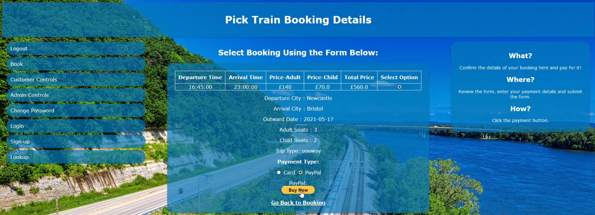

# Train Booking System - Ryan Morgan

database details (database hosted on local machine):  
hostname = "localhost"  
username = "ryan"  
pw = "My.Database121"  
database = "TrainDB"  

Use the admin account. it's the same as the customer account but you can access the admin features.  
Admin User:  
email: ryan@email.com  
password: ryanspassword  

customer user:  
email: elizabeth@email.com  
password: elizabeth  

Receipts maybe created in your "C:\Users\USER" folder.  

Group Implementation:  
page 1: '/horizonTravelBookingService'  
page 2: '/htbsMakeBooking'  
Group Implementation is not functional. It's just to show how we designed it and how it would be implemented.  

Website and code is in 'TrainWebsite' Folder. 'ryan_Booking.txt' is a receipt that was generated for the user with the name 'ryan'.  

sql dump: rmdbdump.sql  

 

